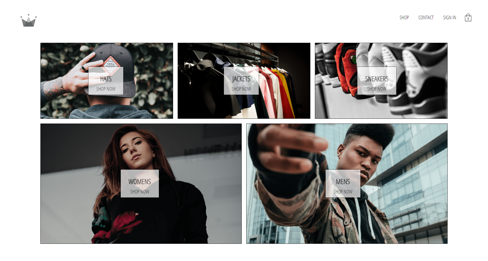

# Bulky Books Website.

#### CRWN Clothing is a basic clothing website built using React, Express, Firebase, Node.js, and Stripe integration.

<br />

### ⚒ Project Demo:

Experience the project in action by visiting our live demo: [CRWN Clothing Demo](https://crwn-clothing-web-demo.vercel.app/)

---

### 🕵️‍♂️ Project Details:

CRWN Clothing is a full-stack web application that allows users to browse and purchase clothing items online. The website combines a modern user interface with seamless payment processing for a smooth and enjoyable shopping experience.

---

### ⚙ Dockerized Execution:

To run project using Docker run the following commands:

For Development:

```bash
  docker-compose -f docker-compose.dev.yaml up
```

For Production:

```bash
  docker-compose -f docker-compose.yaml up
```

---

### 🤹‍♂️ Skills Utilized:

&nbsp;&nbsp;&nbsp;&nbsp;
&nbsp;&nbsp;&nbsp;&nbsp;
&nbsp;&nbsp;&nbsp;&nbsp;
&nbsp;&nbsp;&nbsp;&nbsp;
&nbsp;&nbsp;&nbsp;&nbsp;
&nbsp;&nbsp;&nbsp;&nbsp;
&nbsp;&nbsp;&nbsp;&nbsp;
&nbsp;&nbsp;&nbsp;&nbsp;
&nbsp;&nbsp;&nbsp;&nbsp;
&nbsp;&nbsp;&nbsp;&nbsp;

---

### ✔ Contributors:

We would like to acknowledge the following contributor for their valuable contributions to this project:

<p align="center">
  <a href="https://github.com/faraasat">
    
  </a>&nbsp&nbsp&nbsp&nbsp&nbsp&nbsp&nbsp&nbsp&nbsp&nbsp&nbsp&nbsp
</p>

---

### 📷 Project UI:

Take a glimpse into the captivating world of Natours Tour Static Website:

<p align="center">
  <a href="https://crwn-clothing-web-demo.vercel.app/">
    
  </a>
</p>
